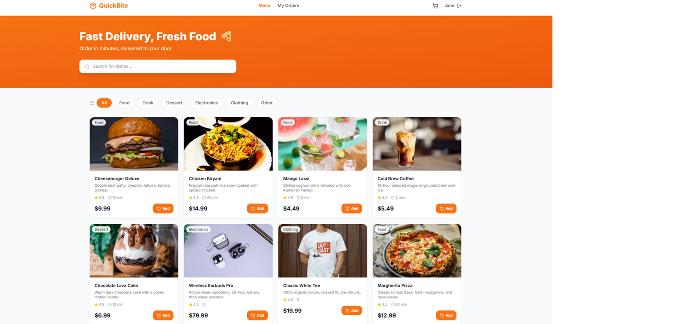
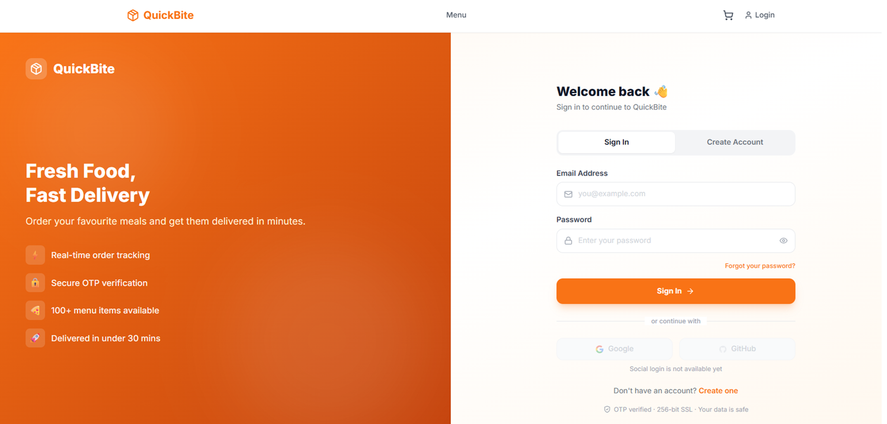
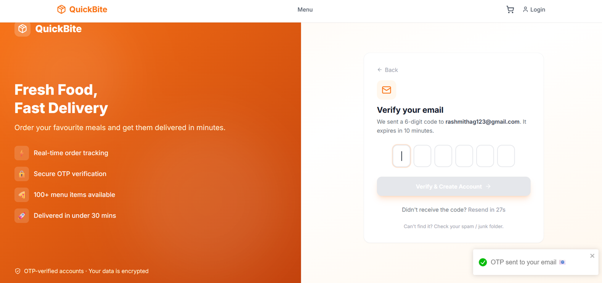
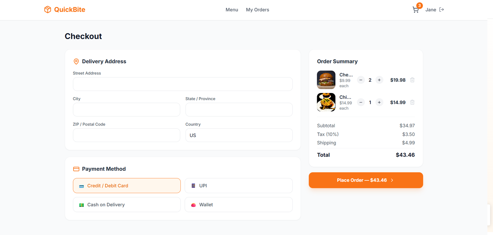
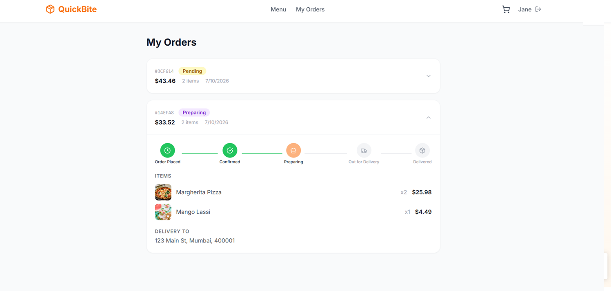
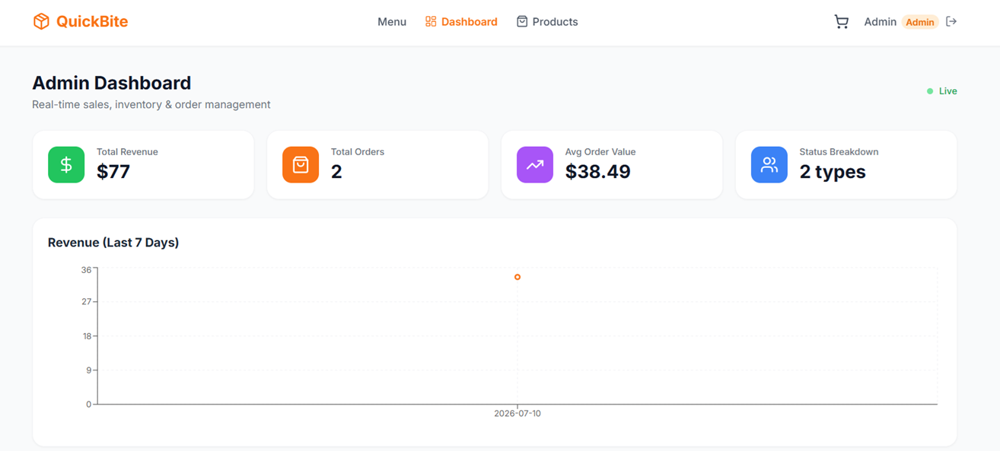
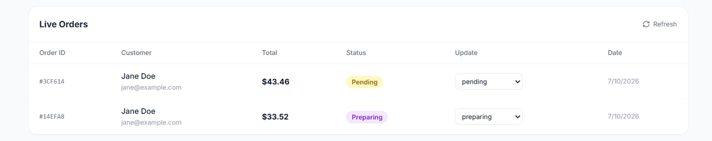
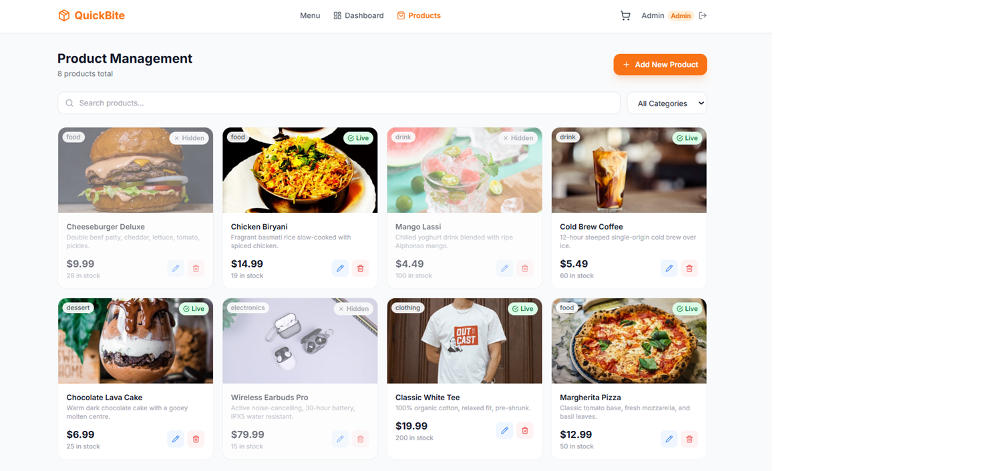

<div align="center">

# 🍕 QuickBite

### Real-Time E-Commerce & Food Delivery Platform

*Browse. Order. Track. Delivered.*

[](https://reactjs.org)
[](https://nodejs.org)
[](https://mongodb.com)
[](https://expressjs.com)
[](https://socket.io)
[](https://tailwindcss.com)
[](https://docker.com)
[](https://vercel.com)
[](LICENSE)

> 🎓 **Student Project** — Built to learn full-stack web development, REST API design, real-time communication with Socket.IO, and containerization with Docker.

<br/>

> A full-stack food delivery web application built as a learning project to explore the MERN stack, real-time features, and modern deployment practices.
> Customers shop and track orders live. Admins manage everything from a real-time dashboard.

<br/>

[🚀 Quick Start](#-quick-start) &nbsp;·&nbsp;
[✨ Features](#-features) &nbsp;·&nbsp;
[🏗 Architecture](#-architecture) &nbsp;·&nbsp;
[📡 API Reference](#-api-reference) &nbsp;·&nbsp;
[🐳 Docker](#-docker-setup) &nbsp;·&nbsp;
[🚢 Deployment](#-deployment)

</div>

---

## 📸 Screenshots

### Customer Experience
| Home — Product Grid | Login Page | OTP Verification |
|---|---|---|
|  |  |  |

| Checkout | Live Order Tracking |
|---|---|
|  |  |

### Admin Experience
| Dashboard — KPIs & Chart | Live Orders Table | Product Management |
|---|---|---|
|  |  |  |

---

## ✨ Features

### 👤 Customer
- Browse products with **keyword search** and **category filters**
- Add to cart with **persistent state** across page refreshes
- Checkout with delivery address and multiple payment options
- **Live order tracking** — status updates instantly via WebSocket without refreshing
- **OTP email verification** on signup — 6-digit code, 10-minute expiry
- **OTP password reset** — secure, no magic links needed

### 👑 Admin
- **Real-time dashboard** — revenue, total orders, average order value
- **7-day revenue chart** built with Recharts
- **Live orders table** — change status via dropdown, customer screen updates instantly
- **Live new-order notifications** — banner appears without refresh
- **Product management** — add, edit, delete, toggle availability with image preview
- **User management** — view and remove accounts

### 🔐 Security
- JWT authentication with role-based access control
- Passwords hashed with bcrypt (12 salt rounds)
- OTP tokens stored as SHA-256 hashes — raw OTP never saved to database
- Rate limiting (100 requests / 15 min per IP)
- Helmet security headers + CORS protection
- Email enumeration prevention on forgot password

---

## 🏗 Architecture

```
┌──────────────────────────────────────────────────────────┐
│                    docker-compose.yml                    │
│                                                          │
│  ┌─────────────────┐       ┌────────────────────────┐    │
│  │    Frontend     │       │       Backend          │    │
│  │  React + Vite   │─────▶│  Node.js + Express     │    │
│  │  Tailwind CSS   │ REST  │  Socket.IO             │    │
│  │  localhost:5173 │       │  localhost:5000        │    │
│  └─────────────────┘       └───────────┬────────────┘    │
│                                        │                 │
│                             ┌──────────▼─────────────┐   │
│                             │       MongoDB          │   │
│                             │  mongoose_data volume  │   │
│                             │  localhost:27017       │   │
│                             └────────────────────────┘   │
└──────────────────────────────────────────────────────────┘
```

### Real-Time Flow
```
Admin changes order status
         │
         ▼
Express controller saves to MongoDB
         │
         ▼
Socket.IO emits to two rooms:
  ├── user_<userId>  →  Customer's order tracker updates live
  └── admins         →  All admin dashboards refresh
```

### Order Status Lifecycle
```
pending ──► confirmed ──► preparing ──► out_for_delivery ──► delivered
                                                          ╲
                                                           ╲──► cancelled
```

Each transition is saved to `Order.statusHistory[]` with a timestamp.

---

## 🗂 Project Structure

```
ecommerce-dashboard/
│
├── 📄 docker-compose.yml          # Orchestrates all 3 services
├── 📄 README.md
│
├── 📁 backend/
│   ├── server.js                  # HTTP server + Socket.IO bootstrap
│   ├── app.js                     # Express middleware, routes, CORS
│   ├── seed.js                    # Populate demo data
│   ├── createAdmin.js             # CLI tool to create admin accounts
│   ├── Dockerfile                 # Multi-stage production image
│   ├── .env.example
│   │
│   ├── config/
│   │   ├── db.js                  # Mongoose connection
│   │   └── emailService.js        # Signup OTP + reset OTP templates
│   │
│   ├── models/
│   │   ├── User.js                # bcrypt hook, OTP generation methods
│   │   ├── Product.js             # Inventory, reviews, categories
│   │   └── Order.js               # Status lifecycle + history array
│   │
│   ├── controllers/
│   │   ├── userController.js      # Auth, OTP signup, OTP password reset
│   │   ├── productController.js   # CRUD + regex search
│   │   └── orderController.js     # Orders + Socket.IO events
│   │
│   ├── routes/
│   │   ├── userRoutes.js
│   │   ├── productRoutes.js
│   │   └── orderRoutes.js
│   │
│   ├── middleware/
│   │   ├── authMiddleware.js      # protect + adminOnly guards
│   │   └── errorMiddleware.js     # 404 + global error handler
│   │
│   └── socket/
│       └── socketManager.js       # Room-based broadcasting
│
└── 📁 frontend/
    ├── index.html                 # Vite entry point
    ├── vite.config.js
    ├── tailwind.config.js
    ├── vercel.json                # SPA rewrite rules
    ├── .env.example
    │
    └── src/
        ├── App.jsx                # Router + context providers
        │
        ├── api/
        │   ├── client.js          # Axios instance + JWT interceptor
        │   └── services.js        # Typed wrappers for all endpoints
        │
        ├── context/
        │   ├── AuthContext.jsx    # Global auth state
        │   └── CartContext.jsx    # Cart state (localStorage backed)
        │
        ├── hooks/
        │   ├── useSocket.js       # Socket.IO connection hook
        │   └── useFetch.js        # Generic data-fetching hook
        │
        ├── components/
        │   ├── layout/            # Navbar, ProtectedRoute
        │   ├── products/          # ProductCard
        │   ├── cart/              # CartSidebar
        │   ├── orders/            # OrderStatusTracker (live)
        │   └── admin/             # AdminDashboard
        │
        └── pages/
            ├── HomePage.jsx            # Product grid, search, filter
            ├── LoginPage.jsx           # Login + Register + OTP flows
            ├── CheckoutPage.jsx        # Address + payment + place order
            ├── OrdersPage.jsx          # Order list + live tracker
            ├── AdminPage.jsx           # KPIs + chart + orders
            └── AdminProductsPage.jsx   # Product CRUD
```

---

## 🚀 Quick Start

### Prerequisites

| Tool | Version | Download |
|---|---|---|
| Node.js | ≥ 18 | https://nodejs.org |
| MongoDB | ≥ 7 | https://mongodb.com/try/download/community |
| Git | Any | https://git-scm.com |
| Docker *(optional)* | Any | https://docker.com/products/docker-desktop |

---

### Option A — Run Locally (Without Docker)

**1. Clone the repository**
```bash
git clone https://github.com/rashmitha-g12/quickbite-ecommerce.git
cd quickbite-ecommerce
```

**2. Backend setup**
```bash
cd backend
cp .env.example .env        # Windows: copy .env.example .env
```

Open `backend/.env` and fill in your values — see [Environment Variables](#-environment-variables).

```bash
npm install
node seed.js                # populate demo products + accounts
npm run dev                 # starts on http://localhost:5000
```

**3. Frontend setup**

Open a second terminal:
```bash
cd frontend
cp .env.example .env        # Windows: copy .env.example .env
npm install
npm start                   # starts on http://localhost:5173
```

**4. Open the app**

```
http://localhost:5173
```

---

### Option B — Run with Docker (Recommended)

```bash
git clone https://github.com/rashmitha-g12/quickbite-ecommerce.git
cd quickbite-ecommerce

# Configure environment
cp backend/.env.example backend/.env
# Edit backend/.env with your values

# Start all 3 services
docker compose up --build

# Seed demo data (in a new terminal)
docker compose exec backend node seed.js
```
> **Note:** If you want to run the seed command inside Docker, remember to remove `seed.js` from your `.dockerignore` file before building the container.

Open **http://localhost:5173**

---

## 🔑 Demo Credentials

> Generated by `node seed.js`

| Role | Email | Password | Access |
|---|---|---|---|
| 👑 Admin | admin@quickbite.com | admin123 | Dashboard, products, all orders |
| 👤 Customer | jane@example.com | password123 | Browse, cart, place orders |

---

## 👑 Creating an Admin Account

### Interactive
```bash
cd backend
node createAdmin.js
```

### One-line
```bash
node createAdmin.js --name "Your Name" --email you@example.com --password yourpassword
```

> Running the script with an **existing user's email** upgrades that account to admin automatically — no duplicate is created.

---

## 📧 Email & OTP Setup

QuickBite uses **6-digit OTP** for both signup verification and password reset. Emails are sent via Gmail SMTP.

### Get a Gmail App Password

1. Go to [myaccount.google.com/security](https://myaccount.google.com/security)
2. Enable **2-Step Verification**
3. Search **"App passwords"** → Select **Mail** → Generate
4. Copy the 16-character password (no spaces)
5. Paste it as `EMAIL_PASS` in `backend/.env`

### OTP Signup Flow
```
User fills form → clicks "Send OTP"
      ↓
Backend generates OTP → hashes with SHA-256 → saves hash to DB
Raw OTP sent to email (expires in 10 min)
      ↓
User enters 6-digit code → Backend verifies hash
      ↓
Account created → redirected to Login page ✅
```

### OTP Forgot Password Flow
```
User enters email → clicks "Send OTP"
      ↓
OTP emailed → User enters code
      ↓
OTP verified → New password screen
      ↓
Password updated → redirected to Login page ✅
```

> **Note:** First emails from a new sender may go to spam. Mark as "Not spam" once — all future emails go to inbox automatically.

---

## 🌐 API Reference

All endpoints are prefixed with `/api`.

### Auth — `/api/users`

| Method | Endpoint | Auth | Description |
|---|---|---|---|
| POST | `/login` | — | Login, returns JWT |
| POST | `/send-otp` | — | Step 1 signup — send OTP to email |
| POST | `/verify-otp` | — | Step 2 signup — verify OTP, create account |
| POST | `/resend-otp` | — | Resend signup OTP |
| POST | `/forgot-password` | — | Send password reset OTP |
| POST | `/verify-forgot-otp` | — | Verify reset OTP |
| POST | `/reset-password-otp` | — | Verify OTP + set new password |
| GET | `/profile` | User | Get own profile |
| PUT | `/profile` | User | Update profile |
| GET | `/` | Admin | List all users |
| DELETE | `/:id` | Admin | Delete user |

### Products — `/api/products`

| Method | Endpoint | Auth | Description |
|---|---|---|---|
| GET | `/` | — | List / search (`?keyword=&category=&page=&limit=`) |
| GET | `/:id` | — | Single product |
| POST | `/` | Admin | Create product |
| PUT | `/:id` | Admin | Update product |
| DELETE | `/:id` | Admin | Delete product |
| POST | `/:id/reviews` | User | Add review |

### Orders — `/api/orders`

| Method | Endpoint | Auth | Description |
|---|---|---|---|
| POST | `/` | User | Place order |
| GET | `/my` | User | My orders |
| GET | `/:id` | User / Admin | Single order |
| PUT | `/:id/pay` | User | Mark as paid |
| GET | `/` | Admin | All orders (`?status=&page=&limit=`) |
| PUT | `/:id/status` | Admin | Update status → emits Socket.IO event |
| GET | `/stats` | Admin | KPIs + 7-day revenue data |

---

## ⚡ Socket.IO Events

> Clients connect with `{ auth: { token: "<jwt>" } }`

### Client → Server

| Event | Payload | Description |
|---|---|---|
| `join_order` | `orderId: string` | Subscribe to a specific order room |
| `leave_order` | `orderId: string` | Unsubscribe from order room |

### Server → Client

| Event | Room | Payload | Trigger |
|---|---|---|---|
| `new_order` | `admins` | `{ orderId, total, user }` | Customer places order |
| `order_updated` | `user_<userId>` | `{ orderId, status, note }` | Admin changes status |
| `order_status_changed` | `admins` | `{ orderId, status }` | Admin changes status |

---

## 🐳 Docker Setup

### Services

| Service | Image | Port |
|---|---|---|
| Frontend | node:20-alpine | 5173 |
| Backend | Custom (multi-stage) | 5000 |
| Database | mongo:7 | 27017 |

### Commands

```bash
# Start all services (foreground)
docker compose up --build

# Start in background
docker compose up -d --build

# View logs
docker compose logs -f

# View backend logs only
docker compose logs -f backend

# Seed demo data
docker compose exec backend node seed.js

# Create admin account
docker compose exec backend node createAdmin.js

# Stop all containers
docker compose down

# Stop and delete database volume
docker compose down -v

# Check running containers
docker ps

# Open shell inside backend container
docker compose exec backend sh
```

### Multi-Stage Dockerfile

The backend uses a two-stage build:
- **Stage 1** — installs production dependencies only (`npm ci --omit=dev`)
- **Stage 2** — copies built files into a clean Alpine image running as a non-root user

This keeps the final image small and removes unnecessary build tools from production.

---

## 🚢 Deployment

### Backend — Docker on Any Cloud (Railway, Render, EC2)

```bash
# Build image
docker build -t quickbite-backend ./backend

# Run with production variables
docker run -d \
  -p 5000:5000 \
  -e NODE_ENV=production \
  -e MONGODB_URI="mongodb+srv://..." \
  -e JWT_SECRET="your-strong-secret" \
  -e CLIENT_URL="https://your-app.vercel.app" \
  -e EMAIL_USER="your@gmail.com" \
  -e EMAIL_PASS="your-app-password" \
  --name quickbite-backend \
  quickbite-backend
```

### Frontend — Vercel

```bash
npm i -g vercel
cd frontend

vercel env add VITE_API_URL       # https://your-backend-url.com
vercel env add VITE_SOCKET_URL    # https://your-backend-url.com

vercel --prod
```

`vercel.json` is already configured to redirect all routes to `index.html` for React Router.

### Database — MongoDB Atlas

1. Create a free cluster at [cloud.mongodb.com](https://cloud.mongodb.com)
2. Whitelist your server IP (or `0.0.0.0/0` for managed platforms)
3. Copy the connection string → `MONGODB_URI` in your backend environment

---

## 🔧 Environment Variables

### `backend/.env`

| Variable | Example | Description |
|---|---|---|
| `PORT` | `5000` | Server listen port |
| `NODE_ENV` | `development` | Enables Morgan logging in dev |
| `MONGODB_URI` | `mongodb://localhost:27017/ecommerce` | Database connection string |
| `JWT_SECRET` | `<64 char random hex>` | Token signing secret |
| `JWT_EXPIRES_IN` | `7d` | Token expiry duration |
| `CLIENT_URL` | `http://localhost:5173` | CORS allowed origin |
| `RATE_LIMIT_WINDOW_MS` | `900000` | Rate limit window (15 min) |
| `RATE_LIMIT_MAX` | `100` | Max requests per window per IP |
| `EMAIL_HOST` | `smtp.gmail.com` | SMTP server host |
| `EMAIL_PORT` | `587` | SMTP server port |
| `EMAIL_SECURE` | `false` | Use TLS (true for port 465) |
| `EMAIL_USER` | `you@gmail.com` | Sender email address |
| `EMAIL_PASS` | `xxxxxxxxxxxxxxxx` | Gmail App Password (16 chars) |

> Generate a strong JWT secret:
> ```bash
> node -e "console.log(require('crypto').randomBytes(64).toString('hex'))"
> ```

### `frontend/.env`

| Variable | Example | Description |
|---|---|---|
| `VITE_API_URL` | `http://localhost:5000` | Backend REST API base URL |
| `VITE_SOCKET_URL` | `http://localhost:5000` | Socket.IO server URL |

---

## 🗺 Roadmap

- [ ] Stripe / Razorpay real payment gateway
- [ ] Google & GitHub OAuth login
- [ ] Product image uploads via Cloudinary
- [ ] Push notifications via Firebase
- [ ] Order cancellation with refund flow
- [ ] Unit and integration tests (Jest + Supertest)
- [ ] CI/CD pipeline with GitHub Actions
- [ ] Winston structured logging + Logtail

---

## 🤝 Contributing

Contributions, issues, and feature requests are welcome.

1. Fork the repository
2. Create your branch — `git checkout -b feature/your-feature`
3. Commit your changes — `git commit -m "feat: add your feature"`
4. Push to the branch — `git push origin feature/your-feature`
5. Open a Pull Request

### Commit Message Convention

```
feat:     new feature
fix:      bug fix
style:    UI/CSS changes
refactor: code restructure without behaviour change
docs:     documentation updates
chore:    config, tooling changes
```

---

## 📄 License

This project is licensed under the **MIT License** — see the [LICENSE](LICENSE) file for details.

---

<div align="center">

**Built with the MERN Stack**

MongoDB · Express · React · Node.js

<br/>

If you found this project helpful, please consider giving it a ⭐

</div>